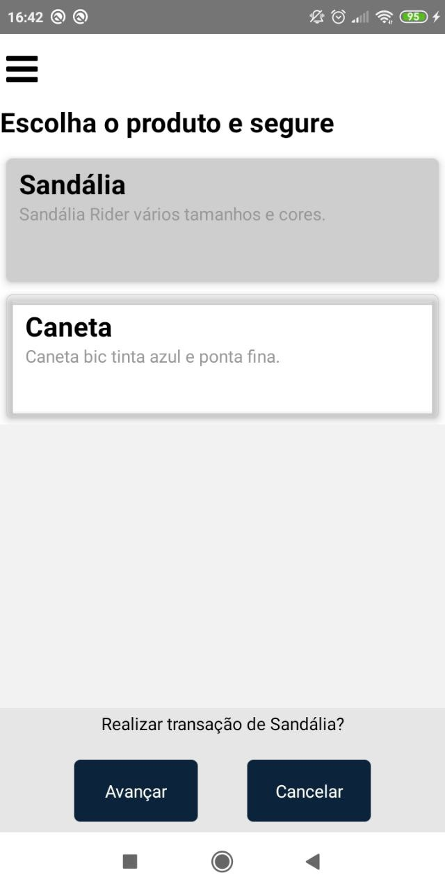

<h1 align="center">Projeto Baixa Estoque</h1>

<p align="center">Aplicativo que simula a compra de produtos e a baixa de estoque pelos sistemas de UEPS, PEPS ou Média Ponderada. Vale ressaltar que mudar o método de baixa de estoque a cada venda como é feito no projeto não é permitido, logo o aplicativo funciona apenas como um simulador. </p>

<h2 align="center">Como testar.</h2>

<p align="center">É necessário instalar as ferramentas <a href='https://git-scm.com'>Git</a>, <a href='https://nodejs.org/'>Node.js</a> e <a href='https://react-native.rocketseat.dev/'>React Native</a>. Também utilize os gerencionares de pacotes: NPM (já vem com o Node) e <a href='https://classic.yarnpkg.com/pt-BR/docs/install/'>Yarn </a>.</p>

1. Clone o projeto no repositório de preferência: 
```bash
git clone <https://github.com/diegofreitas11/projeto-baixa-estoque.git>
```

<h4> Back-end </h4>

1. Acesse a pasta do projeto:
```bash
cd projeto-baixa-estoque/BaixaEstoque/
```

2. Instale todas as dependências:
```bash
npm install
```

3. Rode as migrations para criar as tabelas do banco:
```bash
yarn sequelize db:migrate
```

4. Rode o projeto:
```bash
node server
```


<h4> Front-end </h4>

1. Acesse a pasta do app:
```bash
cd projeto-baixa-estoque/BaixaEstoque/baixaEstoqueApp
```

2. Instale todas as dependências:
```bash
npm install
```

3. Rode o projeto em desenvolvimento:
```bash
yarn start
```
 ou
```bash
npm start
```

6. Rode o emulador ou aplicativo num dispositivo conectado pelo USB:

```bash
yarn android
```

<h2 align="center"> Conceitos utilizados até agora</h2>
<ul>
  <li>Conexão ente Node.js e React Native via Axios;</li>
  <li>Stack, Drawer, Bottom Tab Navigators;</li>
  <li>Modais.</li>
</ul>

<h2 align="center">Alguns prints do projeto.</h2>


<p>Drawer com opções</p>


<p>Cadastro de produtos</p>


<p>Escolha de produto</p>


<p>Escolha de método</p>


<p>Cadastro de vendas (o cadastro de compras é semelhante, mas o campo de valor é digitado diferente do cadastro de vendas que é preenchido automaticamente de acoro com o método escolhido)</p>


<p>Lista de entradas</p>


<p>Lista de saída</p>


